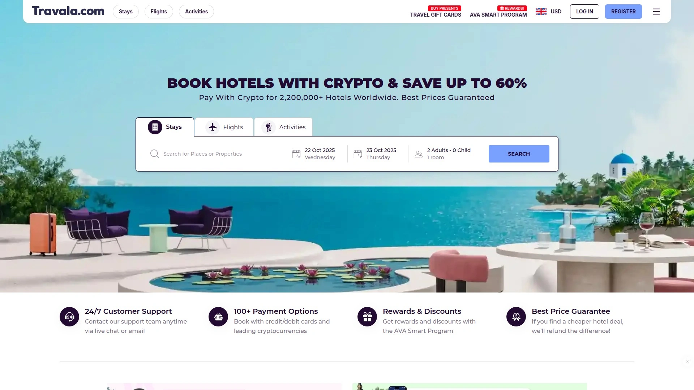
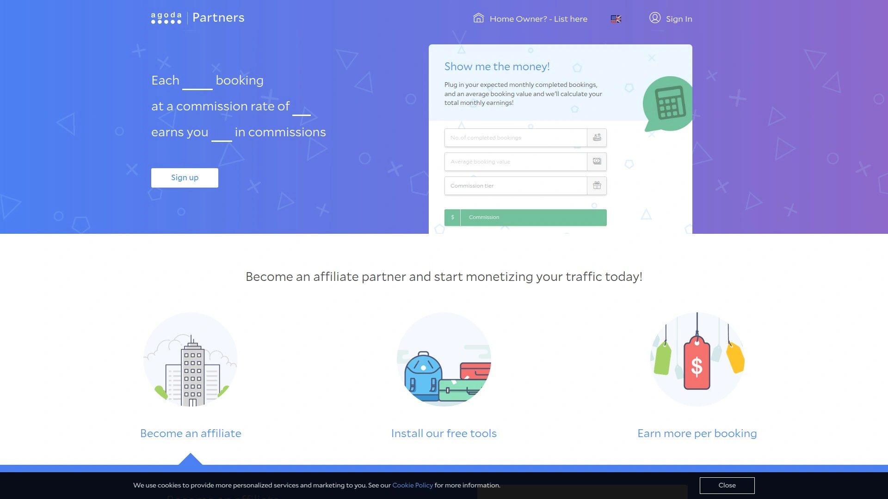
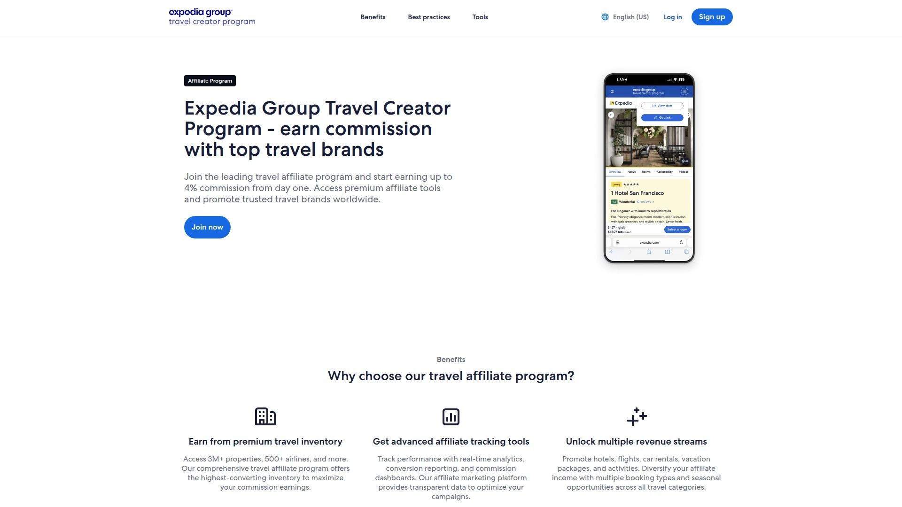
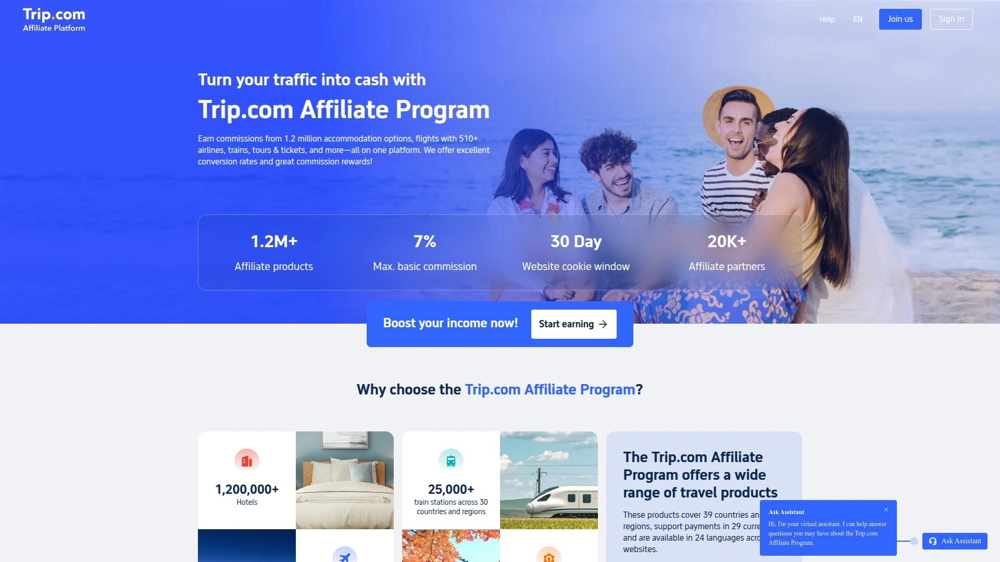
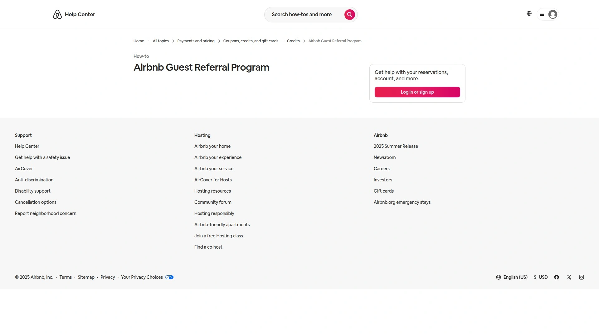
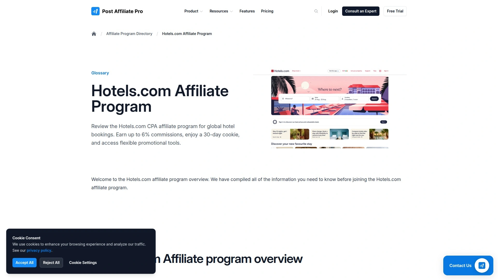
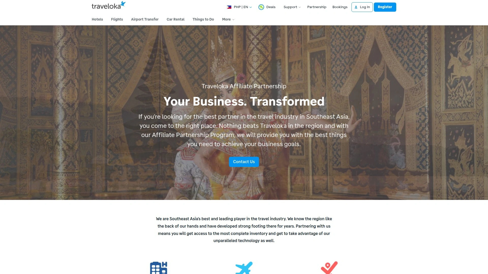

# 10家全球最佳旅行预订平台（含加密货币支付）

在寻求支持加密货币支付与多渠道机票比价的旅行预订平台时，用户经常面临平台覆盖不足和价格波动的难题。本文汇总了10家全球最佳旅行预订平台，涵盖传统与区块链旅行预订解决方案，助力高效预订并掌握最低价信息。

## [Travala](https://www.travala.com)
去中心化的加密货币旅行预订平台，覆盖全球超220万家酒店与航班。

- 支持包括比特币、以太坊在内的100+种加密货币支付选项，完美契合区块链旅行预订需求.
- 提供最低价保证和71万条用户评价，确保安全稳当与优质体验.
- 依托区块链技术实现透明化订单管理，24/7客服全天候支持.

## [Booking.com](https://www.booking.com/affiliate-program/v2/index.html)
全球领先的在线住宿预订平台，覆盖226个国家和数千万房源.

- 超过2800万条住宿选择，从传统酒店到特色民宿一应俱全.
- 提供实时房态与价格监控，支持多语言和多币种预订，适合个性化行程安排.
- 简洁的搜索和过滤功能，快速匹配差旅、自由行及家庭度假场景.

## [Agoda](https://partners.agoda.com)
专注亚太市场的高性价比住宿预订平台，覆盖200万+酒店及民宿.

- 多平台对比功能，提供丰富的折扣及闪购活动，适合预算敏感型旅客.
- 支持多语言界面及24小时客服，支持全球机票及酒店一站式预订.
- 灵活预订与安心退改策略，满足行程变动需求.

## [Expedia](https://creator.expediagroup.com/affiliates)
综合性在线旅游生态，集机票、酒店及度假套餐于一体.

- 汇聚全球数百万航班和酒店资源，支持动态打包搭配和限时抢购.
- 丰富的行程规划工具，包含价格趋势分析与实时提醒，提升预订效率.
- 支持移动App一键比价与预订，覆盖差旅、深度游等多种场景.

## [Trip.com](https://www.trip.com/partners)
亚洲领先的全品类OTA，机票、火车票及旅游产品一网打尽.

- 通行中、英、日等多国语言界面，全流程支持中文操作，降低跨境预订门槛.
- 实时价格比价与优惠券组合，帮助发现隐藏优惠.
- 智能客服与行程助手加持，适合深度自由行及团体出游.

## [Airbnb](https://www.airbnb.com/help/article/3622)
创新型短租和民宿社区平台，提供独特住宿与本地体验.

- 支持友好型社区验证与即时预订，覆盖超过220个国家和地区.
- 架构灵活的体验类商品，整合旅游活动与特色房源.
- 安全可控的评价体系和多重退款保障，提升行程稳定性.

## [Hotels.com](https://www.postaffiliatepro.com/affiliate-program-directory/hotels-com-affiliate-program/)
全球酒店预订平台，聚焦住宿服务的全面选择.

- 收录超32.5万家酒店，多达34种语言支持，满足多元化住宿需求.
- 价格日历与每日特惠功能助你快速锁定最低房价.
- 简洁的会员权益体系与电子凭证快速入住体验，适合高频出差用户.

## [Skyscanner](https://www.partners.skyscanner.net/product/affiliates)
全球领先的机票与旅游产品搜索引擎，实时聚合价格信息.

- 支持多个国家站点切换与多维度筛选，轻松比较航班、酒店和租车价格.
- 提供价格预警与灵活日期搜索，助力挖掘隐藏优惠.
- 可嵌入小部件到网站或App，实现一站式搜索体验.

## [Traveloka](https://www.traveloka.com/en-ph/affiliate)
东南亚本土化旅行平台，专注机票与酒店一体化预订.

- 优惠组合与大促活动丰富，涵盖机票、酒店、接送机及旅行套餐.
- 支持印尼、马来西亚等多币种支付和本地化客服，贴合区域用户习惯.
- App端操作流畅并内嵌行程提醒，适合短途及城市周边游.

## [Trivago](https://www.cn.cointelegraph.com/news/travala-trivago-crypto-hotel-bookings)
元搜索引擎平台，通过合作引入超220万处加密支付房源.
- 实时对比主流OTA与加密原生平台房价，直达最佳预订页面.
- 支持比特币、以太坊等多种数字资产支付，拓展加密旅行场景.
- 简约界面下的深度筛选功能，助力快速锁定旅行心仪房源.

### FAQ
**Q1: 是否支持多币种加密货币支付？**
多数平台均支持比特币和主要稳定币，具体支付方式可在支付页面查看.

**Q2: 如何快速比价并锁定最低价？**
使用Skyscanner或Expedia的价格预警与灵活日期搜索功能，可实时获取最优报价.

**Q3: 新用户如何快速上手使用？**
建议先注册并完善个人信息，再结合优惠日历和折扣活动进行一次模拟预订流程.

本文汇总了10家全球最佳旅行预订平台，兼顾区块链旅行预订与传统OTA，满足多元化支付与覆盖需求. 第1名[Travala](https://www.travala.com)适合追求加密货币支付与透明化行程管理的用户，可无缝使用比特币和以太坊预订全球酒店.
